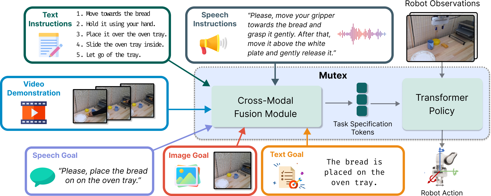

# MUTEX: Learning Unified Policies from Multimodal Task Specifications
   
[Rutav Shah](https://shahrutav.github.io/), [Roberto Martín-Martín](https://robertomartinmartin.com/)<sup>1</sup>, [Yuke Zhu](https://www.cs.utexas.edu/~yukez/)<sup>1</sup>  
7th Annual Conference on Robot Learning  
[[Paper]](https://arxiv.org/abs/2309.14320)    [[Project Website]](https://ut-austin-rpl.github.io/MUTEX/)    [[Dataset]](https://utexas.box.com/s/wepivf85cgini0eqpho9jae9c6o99n4e)    [[Pretrained Weights]](https://utexas.box.com/s/7boowsyjpezcb0h59lz800rejx7yyvn5)    [[Real Robot Controller]](https://ut-austin-rpl.github.io/deoxys-docs/html/getting_started/overview.html)   
<sup>1</sup> Equal Advising  

## Setup  
### Installation
```
git clone --recursive https://github.com/UT-Austin-RPL/MUTEX.git
cd MUTEX && git submodule update --init --recursive
conda create -n mutex python=3.8
conda activate mutex
pip install -r requirements.txt
pip install -e LIBERO/.
pip install -e .
```
### [Datasets](https://utexas.box.com/s/wepivf85cgini0eqpho9jae9c6o99n4e)
Please set the argument `folder=` to the dataset directory in the configs.

### [Pretrained Weights](https://utexas.box.com/s/7boowsyjpezcb0h59lz800rejx7yyvn5)
To use pretrained weights, follow the evaluation instructions mentioned below.

## Usage

### Training
MUTEX is trained in two stages: a) Masked Modeling and b) Cross-Modal Matching.  

To run Masked Modeling,
```
CUDA_VISIBLE_DEVICES=0 python3 mutex/main_masked_modeling.py \
        benchmark_name=LIBERO_100 \
        policy.task_spec_modalities=gl_inst_img_vid_ai_ag \
        policy.add_mim=True policy.add_mgm=True policy.add_mrm=True \
        policy.add_mfm=True policy.add_maim=True policy.add_magm=True \
        folder=dataset-path \
        hydra.run.dir=experiments/mutex
```
To run Cross-Modal Matching,
```
CUDA_VISIBLE_DEVICES=0 python3 mutex/main_cmm.py \
        benchmark_name=LIBERO_100 \
        folder=dataset-path \
        experiment_dir=experiments/mutex
```

### Evaluation

MUTEX is a unified policy capable of executing tasks specified by any modality: video demonstration `vid`, image goal `img`, text goals `gl`, text instructions `inst`, speech goal `ag`, and speech instructions `ai`. To run the model after cross-modal matching at epoch 20 (used in the paper), set `model_name=cmm_LIBERO_100_multitask_model_ep020.pth`.  
An example with text goal modality is given below,
```
MUJOCO_EGL_DEVICE_ID=0 CUDA_VISIBLE_DEVICES=0 python mutex/eval.py \
        benchmark_name=LIBERO_100 \
        folder=dataset-path \
        eval_spec_modalities=gl \
        experiment_dir=mutex_pretrained \
        model_name=mutex_weights.pth
```

### Citation

```
@inproceedings{
    shah2023mutex,
    title={{MUTEX}: Learning Unified Policies from Multimodal Task Specifications},
    author={Rutav Shah and Roberto Mart{\'\i}n-Mart{\'\i}n and Yuke Zhu},
    booktitle={7th Annual Conference on Robot Learning},
    year={2023}
}
```

### Acknowledgements: [Mentioned here](acknowledgements.md)
